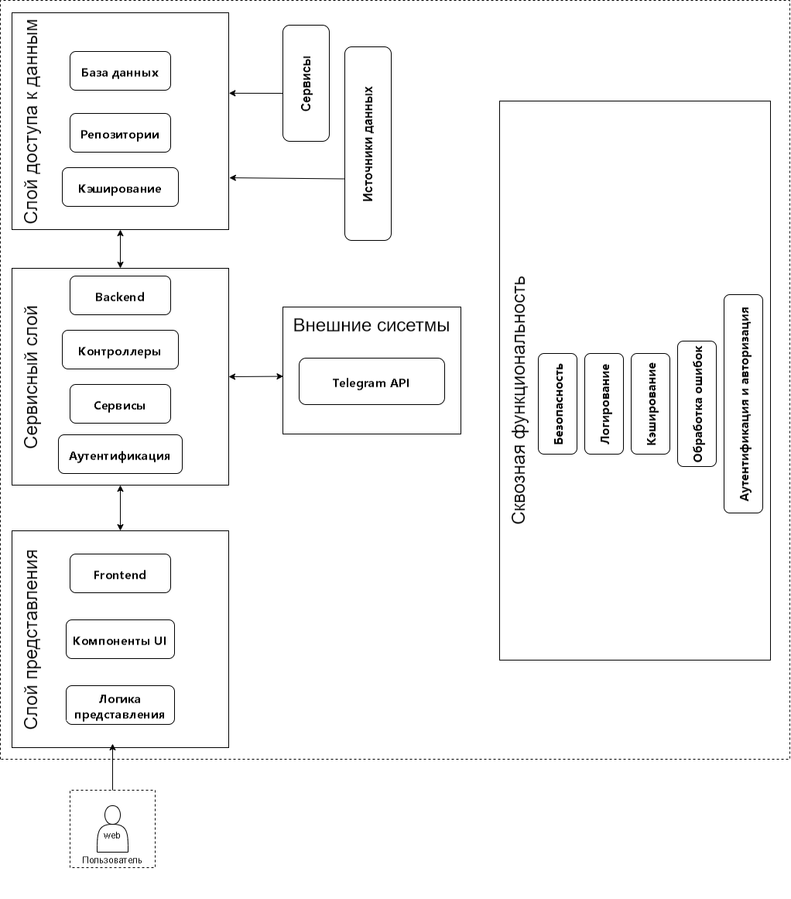
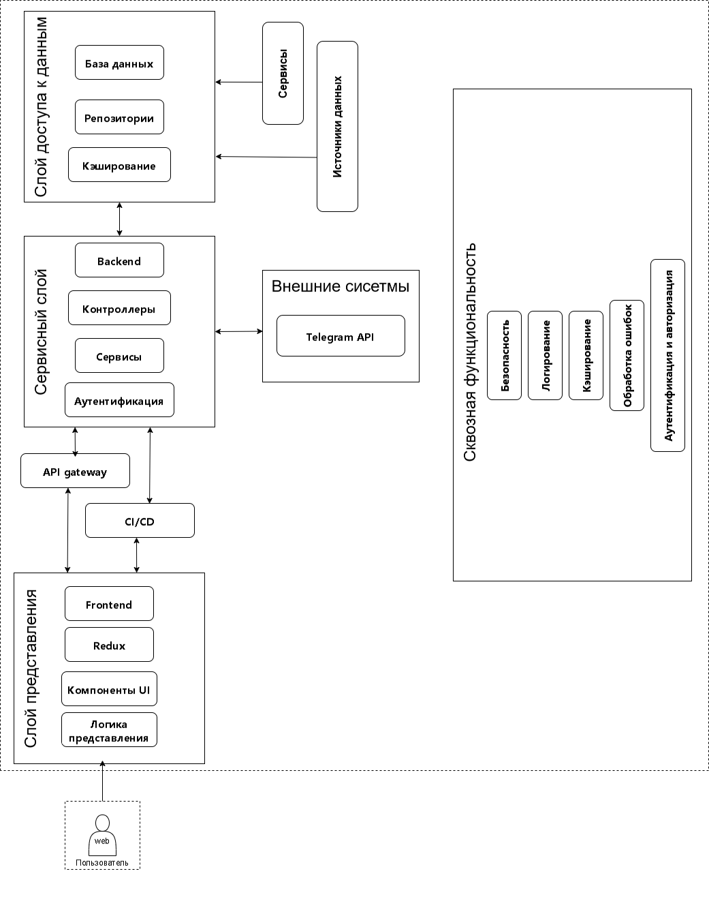

# Архитектура платформы для управления Telegram-каналами

## Часть 1. Проектирование архитектуры («To Be»)

### 1. Определение типа приложения
Платформа представляет собой Web-приложение, включающее:

- **Backend** – Spring Boot API для обработки запросов, взаимодействия с базой данных и Telegram API.
- **Frontend** – веб-приложение на React для управления каналами через браузер.

### 2. Стратегия развёртывания
#### Backend:
- Контейнеризация с Docker.
- Деплой на облачные платформы (AWS, DigitalOcean, Heroku).
- Использование базы данных PostgreSQL для хранения данных пользователей и каналов.
- Кэширование с Redis для ускорения работы и управления сессиями.

#### Frontend:
- Разработка с использованием React.
- Деплой через Vercel, Netlify или серверные платформы (NGINX + Docker).

### 3. Обоснование выбора технологий
#### Backend:
- **Spring Boot** – гибкий фреймворк для RESTful API.
- **Spring Security** – обеспечение безопасности и аутентификации.
- **JWT (JSON Web Token)** – аутентификация пользователей.
- **Telegram Bot API** – взаимодействие с Telegram API.
- **PostgreSQL** – хранение структурированных данных.
- **Redis** – кэширование и управление сессиями.

#### Frontend:
- **React** – JavaScript-фреймворк для разработки SPA.
- **Redux** – управление состоянием приложения.
- **Axios** – взаимодействие с API бэкенда.

### 4. Показатели качества
- **Производительность** – асинхронные операции, кэширование, оптимизация запросов.
- **Масштабируемость** – контейнеризация, облачные решения.
- **Безопасность** – JWT-аутентификация, защищённые соединения (HTTPS).
- **Надёжность** – логирование, обработка ошибок, автоматическое восстановление.

### 5. Реализация сквозной функциональности
#### Backend:
- Логирование (JwtTokenFilter, TelegramBotService).
- Кэширование (Redis).
- Аутентификация (JwtUtil, Spring Security).

#### Frontend:
- Работа с API (Axios).
- Управление состоянием (Redux).
- Кэширование данных в localStorage.

### 6. Структурная схема приложения

## Часть 2. Анализ архитектуры («As Is»)

### 1. Анализ текущей структуры кода
#### Backend:
- `controllers/` – маршрутизация API (UserController, ChannelController).
- `services/` – бизнес-логика (UserService, TelegramBotService).
- `repositories/` – работа с базой данных (UserRepository, ChannelRepository).
- `config/` – конфигурации (SecurityConfig, TelegramBotConfig).
- `util/` – вспомогательные классы (JwtUtil, TelegramAuthValidator).

#### Frontend:
- `components/` – компоненты React (TelegramLoginButton, ChannelList).
- `pages/` – страницы приложения (Dashboard, ChannelManagement).
- `config/` – конфигурации (config.js).
- `App.js` – основной файл приложения.

### 2. Архитектурная диаграмма «As Is»

## Часть 3. Сравнение и рефакторинг

### 1. Сравнение «To Be» и «As Is»
#### API Gateway:
As Is: Нет единой точки входа для API, что усложняет управление запросами.  
To Be: Добавится API Gateway для маршрутизации, аутентификации и балансировки нагрузки.
#### CI/CD:
As Is: Развёртывание вручную, что увеличивает риск ошибок.  
To Be: Внедрение CI/CD (Continuous Integration/Continuous Deployment) для автоматизации тестирования и деплоя.
#### Redux:
As Is: Управление состоянием в React может быть неоптимальным.  
To Be: Добавится Redux для централизованного управления состоянием приложения.

### 2. Выявленные отличия
- Оптимизация взаимодействия backend и frontend (стандартизация API, улучшение обработки ошибок).
- Улучшение модульности сервисного слоя backend.
- Доработка архитектуры frontend с применением лучших практик.

### 3. Пути улучшения архитектуры
- Оптимизация API взаимодействия между backend и frontend.
- Внедрение архитектурных паттернов (CQRS для backend, улучшенное управление состоянием в frontend).
- Автоматизированное тестирование и CI/CD для стабильности развертывания.
